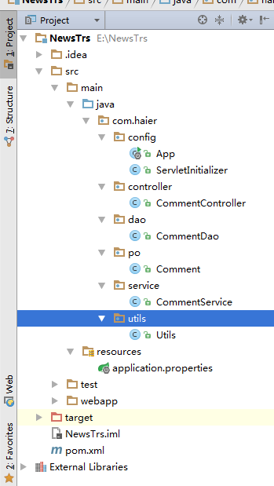

最开始学习了，git，github，maven，IDEA,SpringBoot，wcm等，具体文档看github连接https://github.com/tinghuaxiaobai/TRSstudy
下面是本周的学习内容总结：
#AngularJS
###定义：
	AngularJS有着诸多特性，最为核心的是:MVVM、模块化、自动化双向数据绑定、语义化标签、依赖注入，等等。他克服了html的不足。
	AngularJS通过为开发者呈现一个更高层次的抽象来简化应用的开发。如同其他的抽象技术一样，这也会损失一部分灵活性。换句话说，并不是所有的应用都适合用AngularJS来做。AngularJS主要考虑的是构建CRUD应用。幸运的是，至少90%的WEB应用都是CRUD应用。
	但是要了解什么适合用AngularJS构建，就得了解什么不适合用AngularJS构建。
	如游戏，图形界面编辑器，这种DOM操作很频繁也很复杂的应用，和CRUD应用就有很大的不同，它们不适合用AngularJS来构建。像这种情况用一些更轻量、简单的技术如jQuery可能会更好。
双向传递例子：

	<!DOCTYPE html>
	<html lang="en">
	<head>
	    <meta charset="UTF-8">
	    <title>Title</title>
	    
	    
	</head>
	<body ng-app="mymodule">
	

	    <input type="text" ng-model="name" />
	    {{name}}
	
	1. 将model中的name值拿出来显示在文本框和{{}}这里
	2. 用户在文本框中修改了name值,实际上是修改了model中的name,相当于把值返回给了model
	3.    {{}}再次展示时,又从model中取到了值显示在页面上
	

	
	</body>
	</html>

ng-init 指令初始化 AngularJS 应用程序变量。

ng-app 指令告诉 AngularJS，div>元素是 AngularJS 应用程序 的"所有者"。

ng-model 指令把输入域的值绑定到应用程序变量 name。
###应用
	AngularJS 模块（Module） 定义了 AngularJS 应用。
	AngularJS 控制器（Controller） 用于控制 AngularJS 应用。
	ng-app指令定义了应用, ng-controller 定义了控制器。

	

	 
	名: <input type="text" ng-model="firstName"> 
	姓: <input type="text" ng-model="lastName"> 
	 
	姓名: {{firstName + " " + lastName}}
	 
	

	 
	
[详情连接](http://www.runoob.com/angularjs/angularjs-tutorial.html)

#开发规范与开发流程
1，命名规范

	缩写约定
	包、类名、接口命名约定	
	变量命名约定	
	常用业务参数关键字（bbs\官网互动）	
	WCM中嵌入互动界面的命名规范
2，变量的声明

	每行声明的数量	
	变量初始化和初始化时机	
	类和接口的声明	
	应用系统内部	
	Dubbo分布式接口
3，语句书写约定规范
4，注释规范

	类注释	
	方法注释	
	代码块注释	
	常量、字段及属性注释	
	对已有代码的修改注释
细节请见《青岛办开发规范》
开发流程：

	检出项目	
	设置检出目录	
	刷新项目	
	tomcat插件配置	
	代码的更新	
	代码的提交	
	新建分支	
	提交代码	
	推送代码到远程服务器	
	删除分支	
	合并远程分支	
	查看文件的历史记录	
	对比文件或目录	
	新建模块	

###IDEA检出项目

检出成功，打开项目

新建分支(代码提交)
每次开发某个功能之前或修改bug都必须先建立本地分支，都在dev分支上新建分支，代码完成后都合并到dev分支，然后删除新建的分支。

自己所在位置为自己所建的分支上

提交代码

选择要提交的代码，提交信息必须填写.然后push提交到远程服务器。

需下载[详情请见](https://github.com/tinghuaxiaobai/sss/blob/master/kaifa/开发流程.docx)
###重整代码
用season框架做了一个简单的增删改查功能
项目目录

Controller层代码

	package com.haier.controller;
	
	import com.alibaba.fastjson.JSON;
	import com.alibaba.fastjson.JSONArray;
	import com.haier.po.Comment;
	import com.haier.service.CommentService;
	import com.haier.utils.Utils;
	import com.season.core.ActionKey;
	import com.season.core.Controller;
	import com.season.core.ControllerKey;
	import org.springframework.beans.factory.annotation.Autowired;
	
	import java.util.Date;
	import java.util.List;
	
	/**
	 * Created by Administrator on 2016/12/16 0016.
	 */
	@ControllerKey(value = "hello")
	public class CommentController extends Controller{
    @Autowired
    private CommentService commentService;

    @ActionKey(value = "get")
    public void getCommentByName(){
        String commentName=getPara("name");
        if(Utils.hasLength(commentName)){
            List<Comment> lists=commentService.getCommentByName(commentName);
            renderText(((JSON) JSONArray.toJSON(lists)).toJSONString());
            return;
        }else{
            renderText("参数未赋值！");
        }
    }

    @ActionKey(value ="getaAll")
    public void getCommentAll(){

        List<Comment> list=commentService.getCommentAll();
        renderText(JSONArray.toJSON(list).toString());
    }

    @ActionKey(value = "save")
    public void saveComment(){
        String commentName=getPara("name");
        String conmmentContent=getPara("content");
        if(Utils.hasLength(commentName) && Utils.hasLength(conmmentContent)){
            Comment conmment=new Comment(commentName,conmmentContent);
            commentService.saveComment(conmment);
            return;
        }else{
            renderText("缺少参数值！");
        }

    }
    @ActionKey("update")
    public void updateComment(){
        int icommentId = Integer.valueOf(getPara("id"));
        String scommentContent=getPara("content");
        Date odate=new Date();
        Comment comment=new Comment();
        comment.setId(icommentId);
        comment.setContent(scommentContent);
        commentService.updateComment(comment);

    }
    @ActionKey("delete")
    public void deleteComment() {
        int icommentId = Integer.valueOf(getPara("id"));
        commentService.deleteComment(icommentId);
        return;
    }
	}
[项目链接地址](https://github.com/tinghuaxiaobai/TRSstudy/tree/master/NewsTrs)

###小结：
经过这段时间的学习，已基本了解本公司开发的基本环节与流程，了解掌握了开发规范，对代码的写作有了一定的规范。通过学习了解了HaierFramework的项目结构。明白了项目的检出，与代码提交的流程，对以后的学习有很大的帮助。
